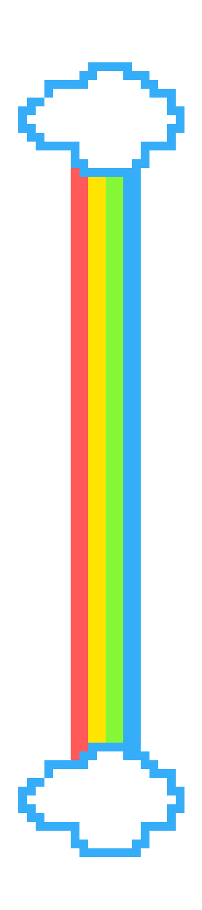

# MarbaxViewer
Application to browse images  

<dev >
</dev>

 Technical Task  

### Создать приложение «Галерея изображений».
  **Основная задача приложения:**
  - [x] предоставить пользователю функциональность для отображения графических файлов различных форматов.  
 
  **Интерфейс приложения должен предоставлять такие возможности:**
  - [x] отображение файловой структуры;
    - [x] общая структура доступных файлов
    - [ ] отображение в дереве только директорий содержащих графические файлы
  - [x] если пользователь заходит в каталог с графическими изображениями, они должны отображаться в виде превью (в качестве примера можно взять механизм работы проводника); 
  - [x] если пользователь кликает по файлу, он отображается на весь экран. При этом необходимо предусмотреть навигацию вперед-назад по текущей папке с изображениями; 
  - [x] копирование, удаление, вставка, перенос графических файлов; 
    - [x] копирование
    - [x] вставка
    - [x] удаление (множество файлов заняты неким процессом и не могут быть удалены)
    - [x] перенос (множество файлов заняты неким процессом и не могут быть удалены)
  - [x] поиск графических файлов (имя файла, расширение, размер, дата создания, теги и т. д.); 
    - [x] имя файла (ищет вглубь начиная с заданой директории,выгружает по 2 файла в секунду в лист, тест проводился 23 минуты,более 2500 файлов)
    - [x] расширение
    - [x] размер
    - [x] дата создания
    - [x] теги
  - [x] история поиска сохраняется, и у пользователя есть возможность ее просмотреть; 
    - [x] сохранение
    - [x] просмотр
  - [x] присвоение тегов папке с графическими файлами, конкретному файлу; 
    - [x] конкретному файлу
    - [x] папке
    - [x] редактирование
  - [x] сохранение настроек приложения. Выбор настроек остается за вами.
    - [x] визуальная тема
      - [x] черная
      - [x] белая
    - [x] цветовая схема для Controls
      - [x] BlueGray
      - [x] Purple
    - [x] вид стрелок на слайдерах
     - [x] Dart Arrow
     - [x] Quadruple Arrow
  - [x] конвертация файла в другой графический формат; 
  - [x] приложение должно поддерживать механизм Drag-and-Drop; 
    - [x] наружу
    - [x] внутрь

